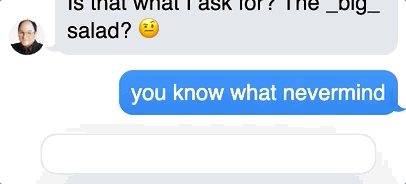

# Exercise 6 - The Footer

**This is a stretch goal.**

To round out the UI, we should add a text input along the bottom. This input will be purely decorative, it won't be able to send new messages.

The most interesting part of the footer is that it blurs the items before it; notice how it glows blue when a sent message passes behind it:

(The GIF compression makes this look like a hot mess; hopefully, your solution will look nicer!)

To achieve this effect, look up the `backdrop-filter` CSS attribute.
